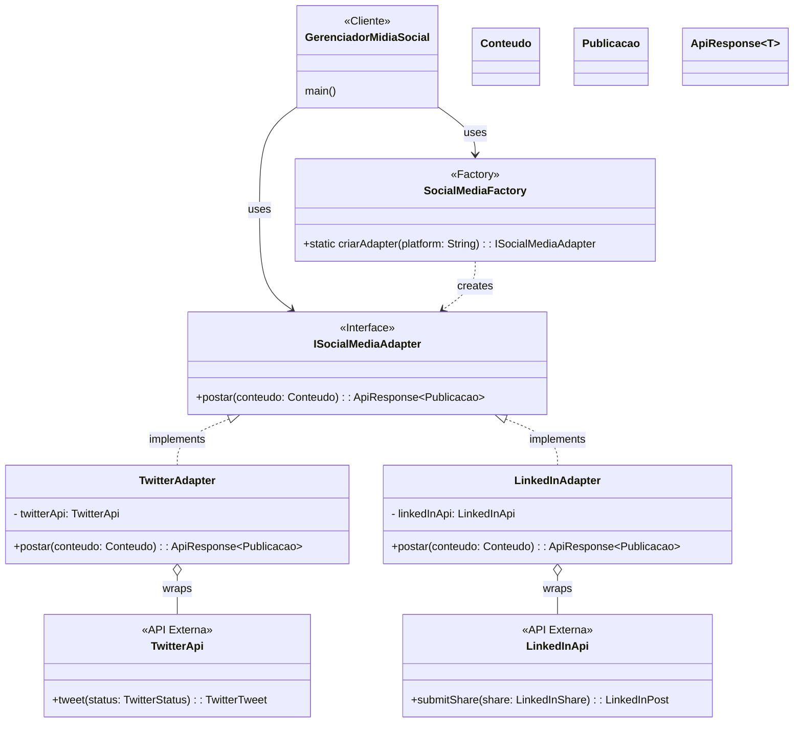

# Aluno: Brian Cristian Cavalheiro 

# Sistema de Integração de Mídias Sociais

Este projeto implementa um sistema unificado para agendamento e publicação de conteúdo em múltiplas redes sociais, utilizando padrões de projeto para criar uma arquitetura flexível e escalável.

## Arquitetura e Padrões de Projeto

A solução foi construída utilizando uma combinação de três padrões de projeto principais para atender aos requisitos de flexibilidade, desacoplamento e extensibilidade.

### Diagrama de Classes (UML)

